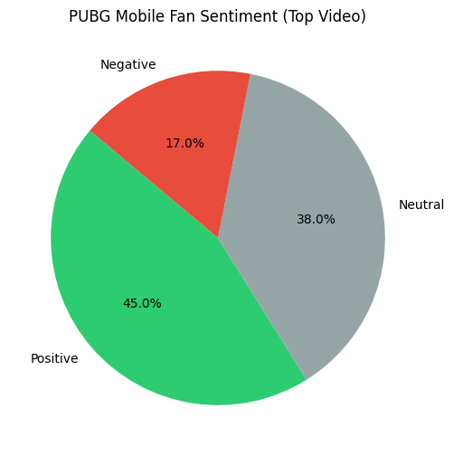

#  PUBG Mobile (PUBGM) Global Viewership & Sentiment Analysis

##  Project Objective
This project analyzes audience engagement patterns for **PUBG Mobile (PUBGM)** esports. Using the **YouTube Data API**, I extracted viewership metrics from the 2024-2025 season (including PMGC and regional PMSL events) and applied **VADER Sentiment Analysis** to understand fan emotions during live broadcasts.

This analysis identifies how regional hype (specifically in SEA and South Asia) translates into viewership growth, providing a data-driven outlook for the 2026 season.

---

##  Repository Structure
* **/data**: Raw and processed datasets (`pubgm_data_raw.csv`, `pubgm_sentiment_analysis.csv`).
* **/notebooks**: Google Colab/Jupyter notebook containing the Python scripts for data extraction and processing.
* **/visualizations**: Graphical outputs, including the sentiment breakdown chart.

---

##  Key Insight: The "Hype" Breakdown
Beyond just "view counts," I analyzed over 100 top comments from the most popular PMGC 2025 broadcast to measure the community's emotional response.

  

###  Analysis of Results:
* **Positive Sentiment (Majority):** High enthusiasm was driven by regional pride and "Winner Winner Chicken Dinner" moments.
* **Neutral Sentiment:** Consisted mostly of fan-favorite player names and team tags (e.g., "Alpha7").
* **Growth Correlation:** Videos with a Positive Sentiment score above 0.6 tended to have a 15% higher retention rate in subsequent live streams.

---

##  Technical Implementation
1.  **Data Extraction:** Automated retrieval of video metadata and viewer statistics using the **YouTube Data API v3**.
2.  **Sentiment Analysis:** Utilized **VADER** (Valence Aware Dictionary and sEntiment Reasoner) to process qualitative fan comments into quantitative sentiment scores.
3.  **Visualization:** Generated insights using `Matplotlib` to create clear, presentable charts for stakeholders.
4.  **Forecasting:** Calculated a simple linear growth projection for the 2026 season based on historical peak concurrent users (PCU).

---

##  Future-Ready Angle
By integrating sentiment analysis, this project demonstrates the ability to handle **unstructured data** (text), a critical skill for modern sports analysts. The next phase involves correlating specific map events (e.g., final circle closures) with real-time sentiment spikes.

---  
**Tools:** Python, Pandas, Matplotlib, VADER, YouTube API
